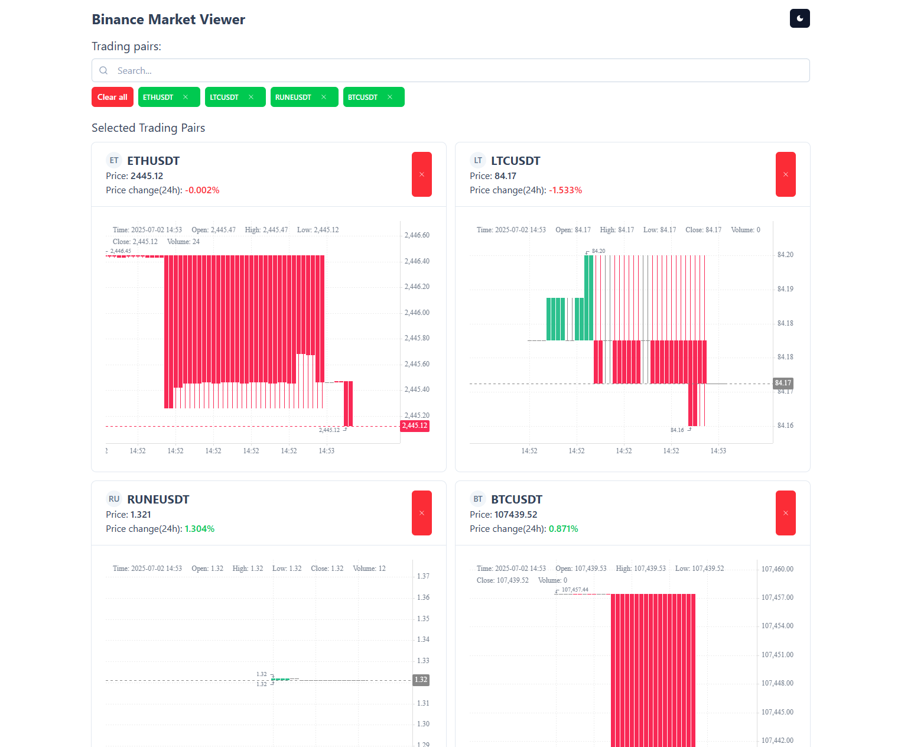

# 📈 Binance Market Viewer



Інтерфейс для перегляду ринку криптовалют з біржі Binance у реальному часі. Показує основну інформацію про пари та candlestick графіки на основі WebSocket API.

---

## 🚀 Основні можливості

- 🔍 Швидкий пошук торгових пар із підтримкою віртуалізації великого списку (1.5k+ пар).
- 💬 Реальний час через WebSocket:
    - Поточна ціна та зміна за 24 години.
    - Дані для побудови **candlestick графіків**.
- 📊 Одночасне відображення графіків для **всіх вибраних пар** — виглядає епічно 🙂
- 💾 Підтримка LocalStorage для збереження вибраних пар.
- ☀️ Темна тема

---

## ⚙️ Технічні деталі

- **Отримання всіх пар** — через Binance REST API.
    - Повертається один великий JSON (~1.5k елементів). Оскільки це відбувається досить швидко і не знайшов особливо інших альтернатив, обрав такий варіант.
    - Відображення оптимізовано за допомогою **віртуалізації списку**. Без віртуалізації воно б лагало, але так працює чудово
- **Реалізація на Nuxt**, однак SSR було **вимкнено** для спрощення роботи з localStorage.
- **Два WebSocket-з'єднання**:
    1. Для базової інформації по парі.
    2. Для candlestick графіка.
- **Аватарки торгових пар** - якоїсь звичайної апішки на швидку руку не знайшов, тому щоб не витрачати на це час вирішив використовувати заглушки 

---

## 🛠️ Використані технології

| Тип | Технології |
|-----|------------|
| 🔧 Інструменти | `Nuxt 3`, `TypeScript`, `Tailwind CSS`, `ESLint`, `Prettier` |
| 📚 Бібліотеки | [`@nuxt/ui`](https://ui.nuxt.com/), [`@nuxt/icon`](https://icon.nuxtjs.org/), `axios`, `vueuse` |
| 📈 Графіки | [`klinecharts`](https://github.com/klinecharts/klinecharts) |
| ⚡️ Віртуалізація | [`vue-virtual-scroller`](https://github.com/Akryum/vue-virtual-scroller) |

---


## Setup

Make sure to install dependencies:

```bash
# npm
npm install

# pnpm
pnpm install

# yarn
yarn install

# bun
bun install
```

## Development Server

Start the development server on `http://localhost:3000`:

```bash
# npm
npm run dev

# pnpm
pnpm dev

# yarn
yarn dev

# bun
bun run dev
```

## Production

Build the application for production:

```bash
# npm
npm run build

# pnpm
pnpm build

# yarn
yarn build

# bun
bun run build
```

Locally preview production build:

```bash
# npm
npm run preview

# pnpm
pnpm preview

# yarn
yarn preview

# bun
bun run preview
```

Check out the [deployment documentation](https://nuxt.com/docs/getting-started/deployment) for more information.
